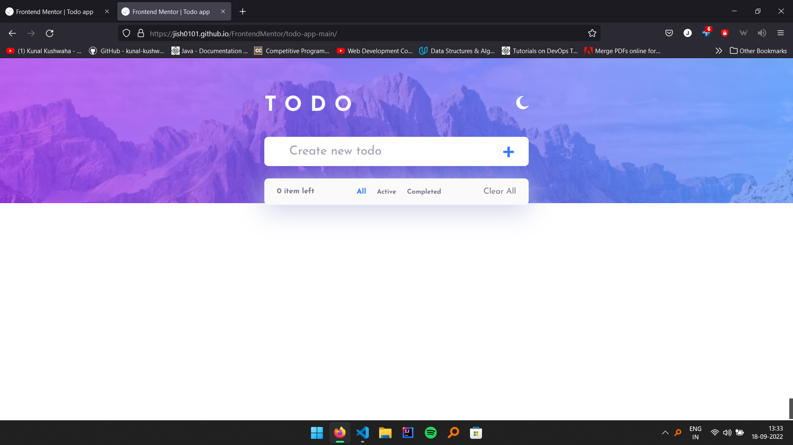

# Frontend Mentor - Todo app solution

This is a solution to the [Todo app challenge on Frontend Mentor](https://www.frontendmentor.io/challenges/todo-app-Su1_KokOW). Frontend Mentor challenges help you improve your coding skills by building realistic projects. 

## Table of contents

- [Overview](#overview)
  - [The challenge](#the-challenge)
  - [Screenshot](#screenshot)
  - [Links](#links)
  - [Built with](#built-with)
  - [What I learned](#what-i-learned)
  - [Continued development](#continued-development)
  - [Useful resources](#useful-resources)
- [Author](#author)

## Overview

### The challenge

Users should be able to:

- View the optimal layout for the app depending on their device's screen size
- See hover states for all interactive elements on the page
- Add new todos to the list
- Mark todos as complete
- Delete todos from the list
- Filter by all/active/complete todos
- Clear all completed todos
- Toggle light and dark mode

### Screenshot

### Links

- Solution URL: [Add solution URL here](https://www.frontendmentor.io/solutions/todo-list-responsive-and-darklight-mode-rg0ZwlaGhp)
- Live Site URL: [Add live site URL here](https://jish0101.github.io/FrontendMentor/todo-app-main/)

## My process

### Built with

- Semantic HTML5 markup
- CSS custom properties
- Flexbox
- CSS Grid
- Mobile-first workflow

### What I learned

I learned various javaScript OOPs method of programming and DOM manipulation..

### Continued development

I will see if people tell me to improve my code.

### Useful resources

Youtube!

## Author

- Website - [Jishan Ahmad]()
- Frontend Mentor - [@jish0101](https://www.frontendmentor.io/profile/jish0101)
- Twitter - [@herJish](https://www.twitter.com/yourusername)
